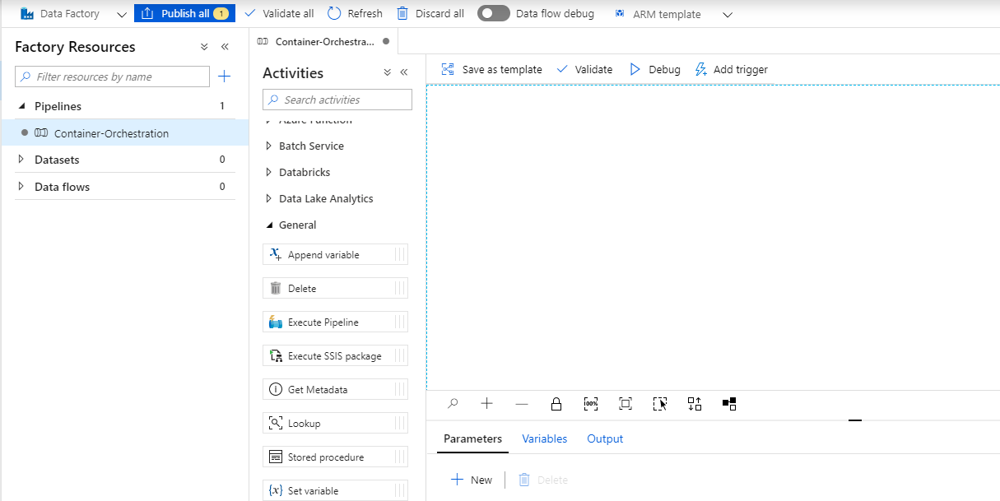
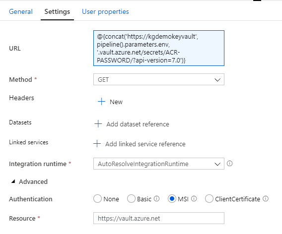
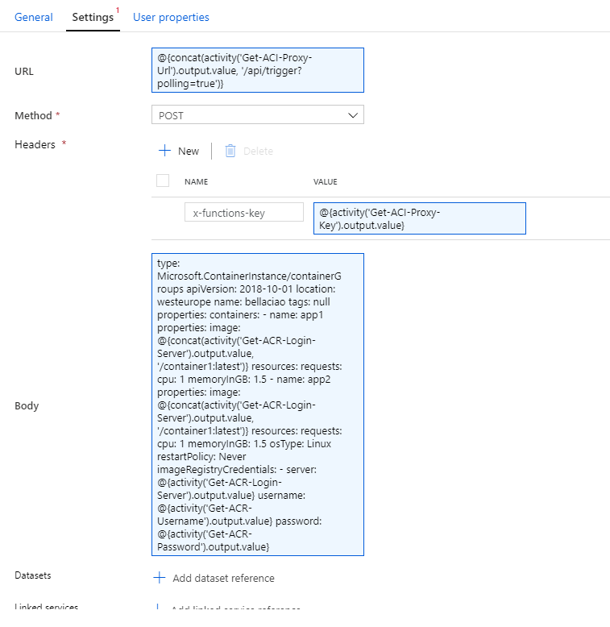
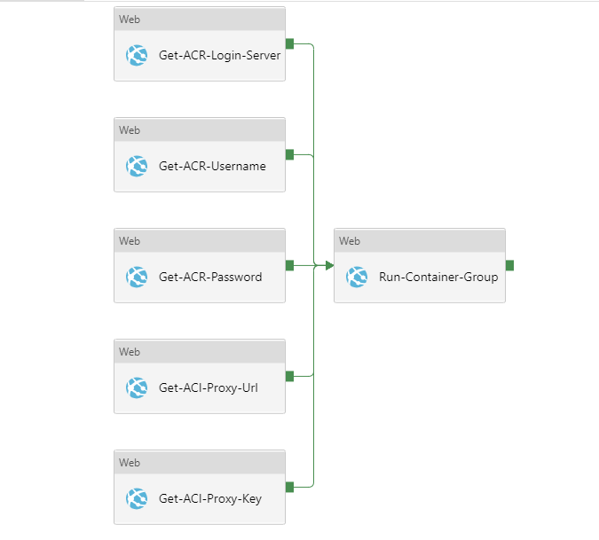
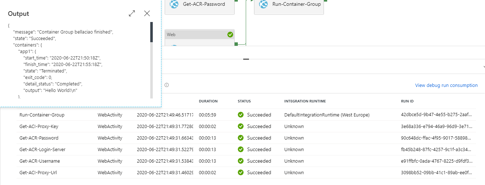

# **Azure Container Instances Proxy**


## **ACI Proxy implemented in Azure Function App (Consumption Plan)**

* **Orchestrate ACI containers using Data Factory in true serverless fashion**
* **Use yaml to define ACI Container Groups**
* **Keep your ACI yaml definition as a part of your Data Factory code**

### **Prerequisites**

* Owner permissions on Azure subscription or resource group
* GIT installed (https://git-scm.com/downloads)
* Docker installed (https://www.docker.com/products/docker-desktop)
* Azure CLI installed (https://docs.microsoft.com/cs-cz/cli/azure/install-azure-cli?view=azure-cli-latest)
* Azure Functions Core Tools installed (https://docs.microsoft.com/cs-cz/azure/azure-functions/functions-run-local?tabs=windows%2Ccsharp%2Cbash)

### **Architecture**

I'm not going to do step by step tutorial how to manually setup all the resources in Azure portal GUI. Instead I will describe the resources needed and their connections.

* **Azure Container Registry** - This is the place where our docker images will be stored.
* **Azure Function App (ACI Proxy)** - Function which is responsible for triggering container instances and getting status of particular instance. This function app needs to be given Contributor permissions on resource group where we are deploying this solution. Thus the person (or service principal) whos deploying the solution needs to have Owner permissions (only Owner can assign permissions).
* **Azure Data Factory** - Main Azure orchestration service.
* **Azure Storage Account** - Every infrastructure needs it's storage.
* **Azure Key Vault** - Service that holds secrets for authorization to individual services. Function App and Data Factory have access to this Key Vault through system managed identity.

### **Getting started**

---

Clone the repository and cd into it.

```
git clone https://github.com/guderkar/ACIProxy.git
cd ACIProxy
```

---

Open the `Infrastructure/infrastructure.parameters.dev.json` in text editor. Replace all the `kgdemo` prefix with prefix of your liking. Usual naming convetion I'm using is `{company_abbreviation}{project_abbreviation}{resource_name}{env}`. Also replace `keyvault_owner_id` value with your object ID which can be found in Azure Active Directory (http://blog.schertz.name/2018/06/locating-ids-in-azure-ad/) and save the file.

---

Create Azure resource group if needed.

```
az group create --name kg-demo-dev --location westeurope
```

---

Deploy the infrastructure in resource group.

```
cd Infrastructure
az deployment group create --resource-group kg-demo-dev --template-file infrastructure.json --parameters infrastructure.parameters.dev.json
```

After this command you have basically all the cloud infrastructure needed set up.

---

Deploy ACIProxy Function App code.

```
cd ..
cd ACIProxy/__app__
func azure functionapp publish kgdemoaciproxydev
```

---
Now let's build some Docker image and push it to Azure Container Registry. The image provided is just simple python script that will sleep for 5 minutes and then prints "Hello World!".

Build docker image

```
cd ../..
cd Containers/container1
docker build . --tag container1:latest
```

Login to Azure Container registry
```
az acr login --name kgdemoacrdev
```

Push Docker image to Azure Container Registry

```
docker tag container1:latest kgdemoacrdev.azurecr.io/container1:latest
docker push kgdemoacrdev.azurecr.io/container1:latest
```

---

Now comes the fun part. Orchestrating containers from Data Factory.

Open Data Factory and create new pipeline, e.g. "Container-Orchestration". And for this pipeline set parameter `env` with value `dev`.



Then create 5 Web Activities and in each activity check Secure output, choose GET method and in Advanced check MSI Authentication and in Resource field fill in `https://vault.azure.net`

* Get-ACR-Login-Server
* Get-ACR-Username
* Get-ACR-Password
* Get-ACI-Proxy-Url
* Get-ACI-Proxy-Key

In each activity fill in URL respectively (dynamic content).

* `@{concat('https://kgdemokeyvault', pipeline().parameters.env, '.vault.azure.net/secrets/ACR-LOGIN-SERVER/?api-version=7.0')}`
* `@{concat('https://kgdemokeyvault', pipeline().parameters.env, '.vault.azure.net/secrets/ACR-USERNAME/?api-version=7.0')}`
* `@{concat('https://kgdemokeyvault', pipeline().parameters.env, '.vault.azure.net/secrets/ACR-PASSWORD/?api-version=7.0')}`
* `@{concat('https://kgdemokeyvault', pipeline().parameters.env, '.vault.azure.net/secrets/ACI-PROXY-URL/?api-version=7.0')}`
* `@{concat('https://kgdemokeyvault', pipeline().parameters.env, '.vault.azure.net/secrets/ACI-PROXY-KEY/?api-version=7.0')}`



Now create another Web Activity called `Run-Container-Group`. Check Secure input and choose POST method.

* URL
```
@{concat(activity('Get-ACI-Proxy-Url').output.value, '/api/trigger?polling=true')}
```

* Headers
```
x-functions-key: @{activity('Get-ACI-Proxy-Key').output.value}
```

* Body
```yaml
type: Microsoft.ContainerInstance/containerGroups
apiVersion: 2018-10-01
location: westeurope
name: bellaciao
tags: null
properties:
  containers:
  - name: app1
    properties:
      image: @{concat(activity('Get-ACR-Login-Server').output.value, '/container1:latest')}
      resources:
        requests:
          cpu: 1
          memoryInGB: 1.5
  - name: app2
    properties:
      image: @{concat(activity('Get-ACR-Login-Server').output.value, '/container1:latest')}
      resources:
        requests:
          cpu: 1
          memoryInGB: 1.5
  osType: Linux
  restartPolicy: Never
  imageRegistryCredentials:
  - server: @{activity('Get-ACR-Login-Server').output.value}
    username: @{activity('Get-ACR-Username').output.value}
    password: @{activity('Get-ACR-Password').output.value}
```



We are basically just POSTing ACI yaml definition to ACI's Proxy `/api/trigger` endpoint. The `?polling=true` parameter makes sure that Data Factory will wait until the container group is finished (ACI Proxy returns status code 202 and Location of status function in header and Data Factory automatically polls the API until it gets any other status code). In case we won't specify `?polling=true` we'll get status code 200 and Data Factory proceeds to next activity immediately.

The Data Factory pipeline now should look like this.



You can now Publish the pipeline and try it with debug run. The output should look like this.



### **Contgratulations**
You have successfully run Azure Container Instances from Data Factory using yaml definition.
